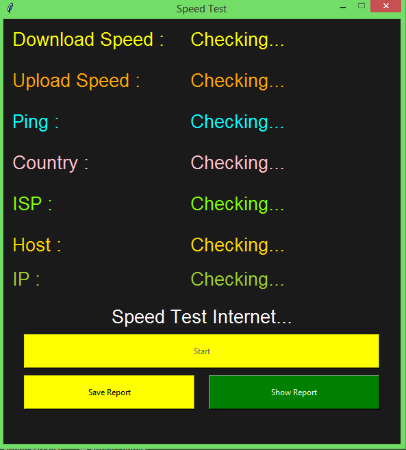

# Speed Test GUI

This application tests the internet speed and displays download speed, upload speed, ping, country, ISP, host, and IP.

## How to Run


1. Clone or download this repository to your local machine.
2. Open the terminal/command prompt and navigate to the project directory.
3. Install the required packages by running the following command:
   ```
   pip install -r requirements.txt
   ```
4. Run the application by executing the following command:
   ```
   python speedtest.py
   ```

## Technologies Used

- Python 3
- tkinter
- speedtest-cli

## Screenshots


